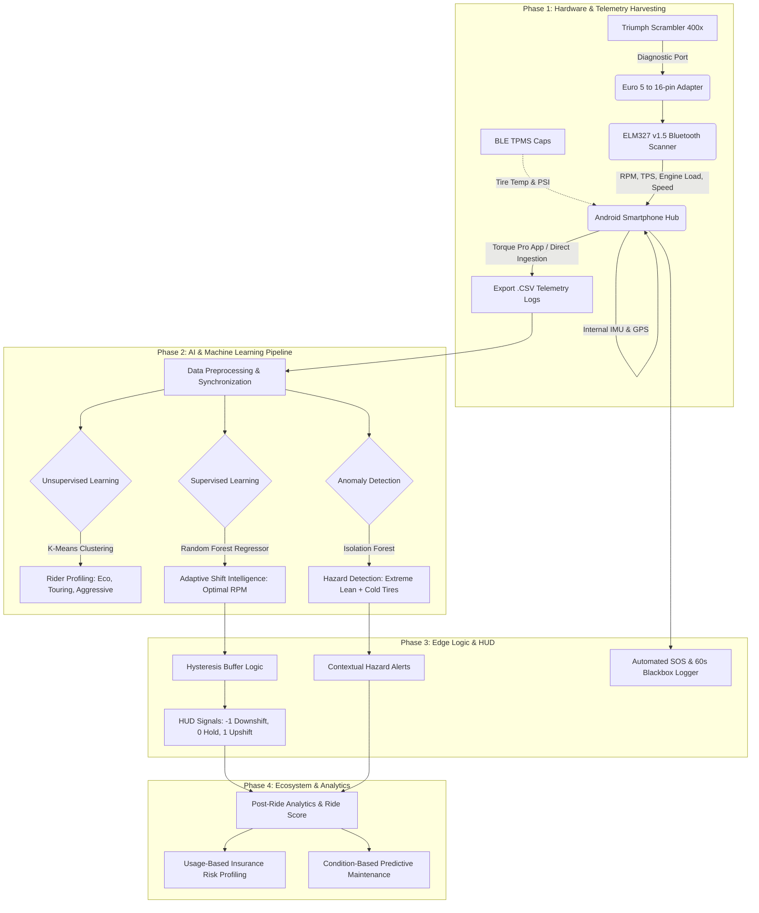

# Motorcycle System: AI-Driven Telemetry & Safety Ecosystem

> **An Edge-AI telemetry and adaptive rider intelligence platform that retrofits modern mid-capacity motorcycles (Triumph Scrambler 400x) into smart, connected vehicles using an ultra-low-cost hybrid architecture.**

**Academic Affiliation:** B.Tech Information Technology, Pimpri Chinchwad College of Engineering  
**Target Platform:** Triumph Scrambler 400x (and compatible Euro 5 OBD-II platforms)  
**Client Applications:** Flutter Cross-Platform Hub (`/Flutter-App`) & Native Android Kotlin Client (`/Android-App`)  
**Machine Learning Pipeline:** Python / Scikit-Learn / TensorFlow Lite (`/Machine-Learning`)

---

## 1. Product Vision & Problem Statement

* **The Problem:** Modern motorcycles feature sophisticated electronic control units (ECUs), yet standard rider interfaces remain static. Current systems rely on hard-coded gear-shift thresholds and fixed-distance service schedules that fail to reflect real-world engine strain, terrain variations, or individual commuting styles. Engine lugging (low RPM under high load) causes destructive cylinder knock, while over-revving degrades fuel economy.
* **The Vision:** Democratize high-end telemetry by bridging the motorcycle's Controller Area Network (CAN) bus directly to mobile devices without expensive OEM proprietary hardware or wire splicing. The edge compute layer evaluates dynamic optimal shift points, monitors tire adhesion hazards, and generates usage-based insurance risk scores.

---

## 2. End-to-End System Architecture



---

## 3. Hardware Architecture & Bridging

The platform employs an ultra-low-cost hybrid architecture requiring **zero wire splicing** or physical modifications to the motorcycle:

| Component | Specification | Function |
| :--- | :--- | :--- |
| **Diagnostic Bridge** | Euro 5 (6-pin ISO 19689) Male to Standard 16-pin OBD-II Female adapter cable | Adapts Triumph proprietary under-seat port to standard OBD-II geometry |
| **Engine Telemetry Scanner** | ELM327 v1.5 Bluetooth Scanner (SPP UUID `00001101-0000-1000-8000-00805F9B34FB`) | Queries CAN Bus PID `010C` (RPM), `010D` (Speed), `0104` (Load), `0111` (TPS) |
| **Tire Telemetry** | Bluetooth Low Energy (BLE 5.0) external valve stem caps | Broadcasts real-time tire pressure (PSI) and internal temperature (°C) |
| **Central Compute Hub** | Handlebar-mounted smartphone | Ingests BLE/OBD-II, samples 6-axis IMU (gyro/accel) & GPS, runs edge AI |

### Euro 5 (6-Pin) to OBD-II (16-Pin) Pinout
```
Triumph Euro 5 (6-Pin)         Standard OBD-II (16-Pin)
Pin 1: CAN High        -------> Pin 6:  CAN High (J-2284)
Pin 2: CAN Low         -------> Pin 14: CAN Low (J-2284)
Pin 3: 12V Battery (+) -------> Pin 16: Permanent +12V Power
Pin 4: Ground (-)      -------> Pin 4 & 5: Chassis & Signal Ground
Pin 5: K-Line (Diag)   -------> Pin 7:  ISO 9141-2 K-Line
Pin 6: Unused / Ign
```

---

## 4. Machine Learning Core (`/Machine-Learning`)

### 1. Data Ingestion & Preprocessing (`data_preprocessing.py`)
- Aligns asynchronous packets from OBD-II (5–10 Hz), BLE TPMS (0.5–1 Hz), and Smartphone IMU (50 Hz) into uniform 100ms millisecond timeline buckets using forward-fill nearest interpolation.
- Computes derived features:
  - Rolling throttle roll-on rate: `d(throttle) / dt` (%/s)
  - Mechanical stress index: `(engine_load_pct * engine_rpm) / 10,000`
  - Contextual cold tire hazard flag: `|lean_angle| > 25°` when `tire_temp < 25°C`

### 2. Model Training & Quantization (`train_models.py`)
1. **Adaptive Shift Intelligence (Supervised Random Forest Regressor)**:
   - **Inputs:** `engine_load_pct`, `throttle_pos_pct`, `road_incline_deg`, `current_gear`
   - **Target:** `optimal_shift_rpm`
   - **Performance:** $R^2 = 0.8304$, $RMSE = 541.07\text{ RPM}$
   - Automatically adapts shift points: under steep inclines or heavy throttle, optimal RPM shifts higher into the powerband; during cruising, shift points adjust lower to maximize fuel economy.
2. **Rider Behavior Profiling (Unsupervised K-Means Clustering, $k=3$)**:
   - **Inputs:** `throttle_pos_pct`, `engine_rpm`, `vehicle_speed_kmh`, `lateral_accel_g`, `longitudinal_accel_g`
   - **Clusters:**
     - **Cluster 0 (Eco Profile):** Avg RPM = ~3,833 RPM, Avg Throttle = ~25.8%
     - **Cluster 1 (Touring Profile):** Avg RPM = ~5,378 RPM, Avg Throttle = ~47.2%
     - **Cluster 2 (Aggressive Profile):** Avg RPM = ~6,930 RPM, Avg Throttle = ~74.0%
3. **Hazard & Anomaly Detection (Unsupervised Isolation Forest)**:
   - Detects extreme lean angle maneuvers on cold tires, unstable corner exits, and anomalous deceleration.

To retrain and export edge weights:
```bash
cd Machine-Learning
python -m pip install numpy pandas scikit-learn joblib
python train_models.py
```

---

## 5. Edge Logic & Safety Safeguards

### Hysteresis Buffer Engine
To prevent erratic shift-cue flicker near shift thresholds, the system executes a **±250 RPM hysteresis buffer**:
- **Upshift Cue (`+1`, Neon Green):** Triggered only when `current_rpm > (optimal_shift_rpm + 250)` and `gear < 6`.
- **Downshift Cue (`-1`, Alert Red):** Instantaneous lugging protection triggered when `current_rpm < 2,500 RPM` under `load > 50%` in gears $> 1$.
- **Hold Cue (`0`, Cyan):** Steady state within the optimal torque band.

### Contextual Cold Tire Hazard Alert
Tire rubber below 25°C has significantly lower coefficient of friction. When lean angle exceeds 25° with cold tires, the HUD immediately displays an alert banner warning against aggressive throttle roll-on.

### Automated SOS & 60-Second Blackbox Ring Buffer
The mobile hub maintains a continuous 60-second rolling ring buffer (600 frames at 10Hz). When an instantaneous crash is detected (`total G-force > 4.5G` or `lean angle >= 80°` at speed), the blackbox automatically locks the telemetry into persistent storage and generates emergency GPS dispatch coordinates.

---

## 6. Ecosystem & Analytics

### 1. Gamified Ride Score (0–100) & Fuel Degrading Habits
Evaluates powertrain and riding discipline:
- **Shift Efficiency Score:** Penalizes engine lugging duration and over-revving (>7,500 RPM).
- **Safety Score:** Deducts for cold-tire lean violations and high-risk overtakes.
- **Smoothness Score:** Rewards progressive throttle roll-on and cornering control.

### 2. Usage-Based Insurance (UBI) Risk Profiling
Structures trip telemetry for "Pay-How-You-Ride" insurance underwriting:
- **Tier 1 (Safe Commuter):** Ride Score $\ge 80 \rightarrow 15\%\text{ to }25\%$ annual policy premium discount.
- **Tier 2 (Moderate Risk):** Ride Score $60 - 79 \rightarrow 5\%\text{ to }13\%$ discount.
- **Tier 3 (High Risk):** Ride Score $< 60 \rightarrow$ Standard base rate or surcharge.

### 3. Condition-Based Predictive Maintenance
Replaces arbitrary 10,000 km service intervals with real mechanical & thermal stress accumulation:
- **Engine Oil & Filter Life (%):** Degraded by thermal stress from over-revs and mechanical lugging knock.
- **Sintered Brake Pads (%):** Tracked against cumulative deceleration energy.
- **O-Ring Drive Chain Slack (%):** Monitors sudden torque spikes and chain stretch.

---

## 7. Flutter Application Setup (`/Flutter-App`)

The Flutter application provides a full automotive cockpit dashboard with real-time HUD, TPMS monitoring, ride analytics, UBI profiling, and prototype telemetry simulation.

### Features:
- **Cockpit HUD:** Circular tachometer with optimal shift marker, digital gear indicator, lean angle gyro visualizer, and TPMS status.
- **Simulation Stream:** Replays the 10,000-row prototype CSV (`cep_telemetry_prototype_dataset.csv`) at 1x, 2x, or 5x speed with live AI inference.
- **Bluetooth Live Mode:** Connects to physical ELM327 Bluetooth scanner and BLE TPMS sensors.

### Running the Flutter App:
```bash
cd Flutter-App
flutter pub get
flutter run
```
*Note: The app contains an integrated simulation mode that plays the 10,000-row prototype telemetry dataset out of the box without requiring physical motorcycle hardware.*

---

## 8. Android Kotlin Application Setup (`/Android-App/SIH-app`)

The repository also includes the native Android Kotlin implementation:
1. Open `/Android-App/SIH-app` in **Android Studio** (Hedgehog or newer).
2. Sync Gradle dependencies.
3. Verify that `cep_shift_model.tflite` is placed in `app/src/main/assets/`.
4. Connect an Android smartphone (API 24+) via USB with USB Debugging enabled.
5. Build and install via `Run 'app'`.

---

## 9. Project Directory Structure

```
Motorcycle-System-main/
├── README.md                                  # Complete Project Architecture & Documentation
├── Flutter-App/                               # Full Cross-Platform Mobile Hub
│   ├── pubspec.yaml                           # Flutter Dependencies & Asset Declarations
│   ├── assets/
│   │   ├── cep_telemetry_prototype_dataset.csv
│   │   ├── cep_shift_model.tflite
│   │   └── edge_intelligence_weights.json
│   ├── lib/
│   │   ├── main.dart                          # App Entry Point & Dark Theme Cockpit
│   │   ├── models/
│   │   │   ├── telemetry_frame.dart           # Unified Telemetry Data Model
│   │   │   └── ride_metrics.dart              # Ride Score, UBI & SOS Blackbox Models
│   │   ├── ai/
│   │   │   ├── shift_intelligence.dart        # Dynamic Shift Predictor & Hysteresis
│   │   │   ├── hazard_detector.dart           # Cold Tire Lean & Anomaly Detection
│   │   │   └── rider_profiler.dart            # K-Means Rider Classification (Eco/Touring/Aggressive)
│   │   ├── services/
│   │   │   ├── obd_service.dart               # ELM327 Bluetooth Driver & Hex PID Decoder
│   │   │   ├── tpms_service.dart              # BLE TPMS External Valve Cap Driver
│   │   │   ├── sos_blackbox_service.dart      # 60-Second Ring Buffer Crash Lockbox
│   │   │   ├── telemetry_simulator_service.dart # 10,000-Row CSV Real-Time Replay Engine
│   │   │   ├── predictive_maintenance_service.dart # Condition-Based Wear Tracker
│   │   │   └── ubi_service.dart               # Usage-Based Insurance Calculator
│   │   ├── screens/
│   │   │   ├── dashboard_hud_screen.dart      # Real-Time Cockpit HUD
│   │   │   ├── post_ride_analytics_screen.dart # Gamified Ride Score & Habit Breakdown
│   │   │   ├── ubi_insurance_screen.dart      # Pay-How-You-Ride Insurance Dashboard
│   │   │   ├── predictive_maintenance_screen.dart # Component Wear Indicators
│   │   │   ├── blackbox_sos_screen.dart       # Crash Lockbox Incident Review
│   │   │   └── settings_screen.dart           # Hardware Scanner & Simulation Tuning
│   │   └── widgets/
│   │       ├── shift_cue_banner.dart          # Dynamic Shift Action Banner
│   │       ├── tachometer_gauge.dart          # CustomPainter RPM Tachometer Arc
│   │       ├── lean_angle_widget.dart         # IMU Horizon Roll Visualizer
│   │       ├── tpms_tire_card.dart            # Front/Rear Tire PSI & Temp Cards
│   │       └── metric_card.dart               # Telemetry Metric Tiles
│   └── android/                               # Android Native Wrapper & Permissions
├── Android-App/
│   └── SIH-app/                               # Native Android Kotlin Implementation
│       └── app/src/main/
│           ├── AndroidManifest.xml
│           ├── assets/cep_shift_model.tflite
│           └── java/com/example/sih/
│               ├── MainActivity.kt            # HUD Activity with TFLite & UI Binding
│               └── OBDConnectionManager.kt    # ELM327 Bluetooth Socket & Hex PID Parser
└── Machine-Learning/
    ├── cep_telemetry_prototype_dataset.csv     # 10,000-Row Synchronized Prototype Dataset
    ├── cep_shift_model.tflite                 # Pre-trained TFLite Model
    ├── data_preprocessing.py                  # Asynchronous Stream Preprocessor
    ├── train_models.py                        # Multi-Model ML Training Pipeline
    ├── adaptive_shift_rf.joblib               # Random Forest Regressor Artifact
    ├── rider_profile_kmeans.joblib            # K-Means Profiler Artifact
    ├── hazard_isolation_forest.joblib         # Isolation Forest Anomaly Detector
    └── edge_intelligence_weights.json         # Quantized Mobile Edge Weights
```
